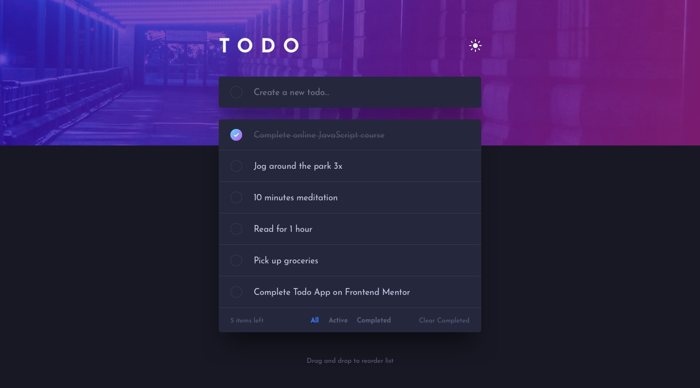

# Frontend Mentor - Todo App Solution

This is my solution to the **Todo App** challenge on Frontend Mentor. The project focuses on building a responsive and interactive todo application with theme switching, filtering, and global state management using React and Zustand.

## Table of Contents

- [Overview](#overview)
  - [The Challenge](#the-challenge)
  - [Screenshot](#screenshot)
  - [Links](#links)
- [My Process](#my-process)
  - [Built With](#built-with)
  - [Features](#features)
  - [Project Structure](#project-structure)
  - [What I Learned](#what-i-learned)
  - [Continued Development](#continued-development)
  - [AI Collaboration](#ai-collaboration)
- [Getting Started](#getting-started)
- [Author](#author)

---

# Overview

## The Challenge

Users should be able to:

- View the optimal layout depending on their device's screen size.
- Add new todos.
- Mark todos as completed.
- Delete todos.
- Filter todos by:
  - All
  - Active
  - Completed
- Clear completed todos.
- Toggle between Light and Dark mode.
- View hover states for interactive elements.

---

## Screenshot



> Replace the image above with your project screenshot.

---

## Links

- **Solution URL:** https://www.frontendmentor.io/solutions/todo-app--CMwl6I1z_
- **Live Site:** https://todo-app.bikazdev.workers.dev/

---

# My Process

## Built With

- React 19
- Vite 8
- Zustand
- Tailwind CSS v4
- JavaScript (ES6 Modules)
- React Icons

---

## Features

- ✅ Add new todos
- ✅ Remove todos
- ✅ Toggle completed status
- ✅ Filter todos (All, Active, Completed)
- ✅ Clear completed todos
- ✅ Light/Dark theme toggle
- ✅ Responsive design
- ✅ Global state management using Zustand
- ✅ Clean component-based architecture
- ✅ Drag and Drop reordering (HTML5 Drag & Drop API)
- ✅ Touch support for mobile drag and drop
- ✅ Persistent todos with Zustand Persist

---

## Project Structure

```text
src
│
├── assets
│   ├── design
│   ├── fonts
│   └── icons
│
├── components
│   ├── Todo
│   │   ├── TodoItem.jsx
│   │   ├── TodoList.jsx
│   │   └── TodoMain.jsx
│   │
│   ├── Footer.jsx
│   ├── Header.jsx
│   └── Input.jsx
│
├── store
│   └── useTodo.js
│
├── App.jsx
├── App.css
├── index.css
└── main.jsx

public
│
└── images
    ├── bg-desktop-dark.jpg
    ├── bg-desktop-light.jpg
    ├── bg-mobile-dark.jpg
    ├── bg-mobile-light.jpg
    ├── favicon-32x32.png
    ├── favicon.svg
    ├── icon-check.svg

```

---

## What I Learned

Building this project helped me gain practical experience with several important React concepts.

### Zustand for Global State Management

Instead of prop drilling, I managed the application's state using Zustand. This made the code cleaner and easier to maintain.

```javascript
const { todos, addTodo, removeTodo, toggleTodo } = useTodoStore();
```

### Native Drag and Drop

Instead of using a third-party library, I implemented drag-and-drop functionality using the native HTML5 Drag and Drop API.

To support mobile devices, I also handled touch events by tracking the touched todo and detecting the drop target with `document.elementFromPoint()`.

During this implementation, I learned how to:

- Handle native drag events (`dragstart`, `dragover`, `drop`)
- Support touch devices using `touchstart` and `touchend`
- Reorder arrays efficiently with `splice()`
- Synchronize reordered data with Zustand state
- Keep animations smooth using Motion's `layout` prop

```javascript
const dragged = copyTodo.splice(dragIndex, 1)[0];
copyTodo.splice(dropIndex, 0, dragged);
```

### Persisting State with Zustand

I used Zustand's `persist` middleware to automatically save and restore todos from localStorage.

To avoid storing unnecessary UI state, I used the `partialize` option so that only the `todos` array is persisted while temporary values such as filters and input text are recreated from their default state after a refresh.

```javascript
persist(
  (set) => ({
    // store
  }),
  {
    name: "todo-storage",
    partialize: (state) => ({
      todos: state.todos,
    }),
  },
);
```

---

### Filtering Data Dynamically

I learned how to create different views of the same data by filtering based on the selected category.

```javascript
const filteredTodos = todos.filter((todo) => {
  if (isActive === "Active") return !todo.checked;
  if (isActive === "Completed") return todo.checked;
  return true;
});
```

---

### Theme Switching

I implemented a light/dark theme by toggling the `dark` class on the root HTML element.

```javascript
const root = document.documentElement;

if (theme) root.classList.add("dark");
else root.classList.remove("dark");
```

---

### Component-Based Design

Breaking the application into reusable components made the project easier to organize and maintain.

Components include:

- Header
- Footer
- Input
- TodoList
- TodoItem
- TodoMain

---

### Responsive Layout

Using Tailwind CSS allowed me to build a mobile-first responsive layout with minimal custom CSS.

---

## Continued Development

For future improvements, I plan to add:

- Keyboard accessibility improvements
- Better animations and transitions
- Unit testing
- Edit existing todos
- Custom categories
- Due dates

---

## AI Collaboration

AI tools were used as a learning assistant during development.

They helped with:

- Debugging React components
- Understanding Zustand patterns
- Learning native HTML5 Drag and Drop
- Implementing touch support for drag and drop
- Understanding Zustand Persist middleware
- Learning selective persistence with `partialize`
- Improving component structure
- Reviewing implementation ideas

All implementation decisions, integration, and testing were completed manually.

---

# Getting Started

## Install dependencies

```bash
npm install
```

## Start the development server

```bash
npm run dev
```

## Build for production

```bash
npm run build
```

## Preview production build

```bash
npm run preview
```

---

# Author

- GitHub - https://github.com/bikazdev
- Frontend Mentor - https://www.frontendmentor.io/profile/bikazdev
